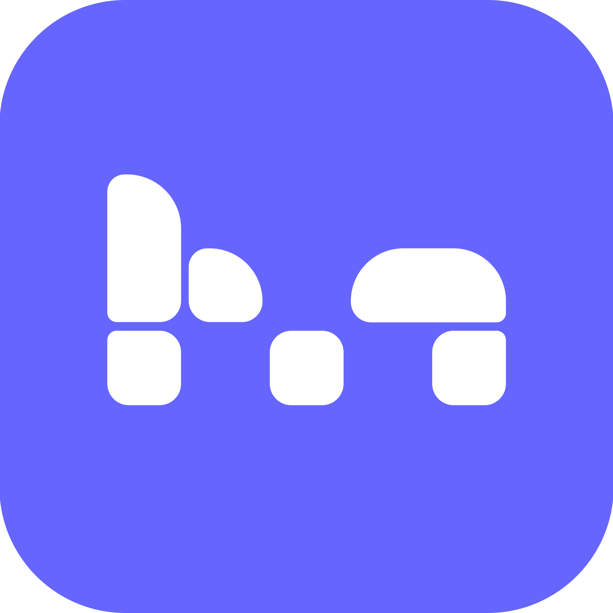

<div align="center">



# mosaic

**A local-first, widget-based personal dashboard.**
Boards full of tasks, notes, calendars, trackers, and more — in your browser or as a desktop app.
No account. No server. Your data stays on your device.

[](https://github.com/Aetherion7/mosaic/actions/workflows/ci.yml)
[](LICENSE.md)
[](https://github.com/Aetherion7/mosaic/releases/latest)

[Download](#download) · [Features](#features) · [Getting started](#getting-started) · [Contributing](#contributing) · [Support the project](#support-the-project)

</div>

---


## What is mosaic?

mosaic is a dashboard you actually own. Instead of a wall of unrelated apps and tabs, you arrange
**widgets** — tasks, a calendar, notes, trackers, a reader, a spreadsheet, and more — onto **boards**
that look and behave exactly the way you want. Everything lives in your browser's IndexedDB; there
is no mosaic server and no account, so there's nothing to sign up for and nothing that can lock you
out of your own data.

- **17 widget types** — task/habit tracking, notes, calendar, spreadsheet with formulas, drawboard,
  PDF/EPUB reader with highlights, charts, weather, map, clock, timer, water and sleep tracking,
  agenda, quicklinks, images, and free text.
- **18 built-in themes** (plus your own custom ones) — from Deep Space to Soft Light, each with its
  own accent colors and background pattern; every widget can additionally be styled individually.
- **Optional AI assistant (bring your own key)** — connect your own Anthropic/OpenAI/Gemini (or any
  OpenAI-compatible) API key and let it build and manage boards with you, or open a mini chat scoped
  to a single widget. Your key and your prompts go straight from your browser to your chosen
  provider — never through a mosaic server, because none exists.
- **Works everywhere** — responsive desktop and mobile layouts, plus native desktop apps for
  Windows, macOS, and Linux with automatic updates.
- **Local-first by design** — boards, widgets, and settings never leave your device. See
  [Privacy & data](#privacy--data) for the handful of widgets that talk to external services
  (maps, weather, the optional AI) and exactly what they send.
- **Bilingual** — full English/German UI, switchable anytime.

## Download

| Platform | Download |
|---|---|
| Windows | [Latest `.exe` installer](https://github.com/Aetherion7/mosaic/releases/latest) |
| macOS | [Latest `.dmg`](https://github.com/Aetherion7/mosaic/releases/latest) |
| Linux | [Latest `.AppImage` / `.deb`](https://github.com/Aetherion7/mosaic/releases/latest) |
| Browser | No install — [run it locally](#getting-started) or host it yourself |

Each link opens the release page; download the asset for your platform from the list of files
attached to it. The desktop app checks for updates automatically and installs them in the
background — you'll always be on the latest version. Builds aren't code-signed yet (that costs
money — see [GITHUB_SETUP.md](GITHUB_SETUP.md)), so Windows SmartScreen and macOS Gatekeeper will
warn about an "unknown publisher" on first launch. That's expected for an unsigned build, not a
sign anything is wrong.

## Features

<table>
<tr>
<td width="50%">

**Boards & widgets**
- Infinite canvas or fixed grid layout per board
- Drag, resize, duplicate, lock, and style every widget
- Undo/redo, board templates, folders, search
- Import/export boards and full backups as JSON

</td>
<td width="50%">


</td>
</tr>
<tr>
<td width="50%">


</td>
<td width="50%">

**Themes & appearance**
- 18 built-in themes (dark and light), plus custom themes via JSON
- Per-widget styling: color, gradient, border, shadow, glow, transparency
- Two header styles, animation toggle, keyboard-shortcut hints

</td>
</tr>
<tr>
<td width="50%">

**AI assistant (bring your own key)**
- Board-wide assistant that can add/edit/style widgets and switch themes
- Per-widget mini chat, scoped so it can only touch that one widget
- Works with Anthropic, OpenAI, Gemini, or any OpenAI-compatible endpoint
  (including local models via Ollama/LM Studio)
- Fully optional — disable it entirely in Settings

</td>
<td width="50%">


</td>
</tr>
</table>

## Getting started

Run mosaic locally in about a minute:

```bash
git clone https://github.com/Aetherion7/mosaic.git
cd mosaic
npm install
npm run dev
```

Open **http://localhost:3001**. That's it — no database, no `.env` file, no account.

Prefer the packaged desktop app? Grab it from [Download](#download), or build it yourself:

```bash
npm run electron:dev     # dev mode — hot reload, same as `npm run dev` in an Electron window
npm run electron:pack    # unpacked build for your current OS (for testing)
npm run electron:dist    # installer for your current OS
```

Cross-platform installers (Windows/macOS/Linux, code-signed if you've set up certificates) are built
automatically by [`.github/workflows/release.yml`](.github/workflows/release.yml) whenever a `v*` tag
is pushed — see [GITHUB_SETUP.md](GITHUB_SETUP.md) for the full release process.

### Requirements

- Node.js 20+
- npm (the repo is developed against `npm ci`/`package-lock.json`)

### Scripts

| Command | What it does |
|---|---|
| `npm run dev` | Start the dev server on port 3001 |
| `npm run build` | Production build |
| `npm start` | Run the production build |
| `npm test` | Run the unit test suite (Vitest) |
| `npm run lint` | Lint the codebase |
| `npm run electron:dev` | Run the desktop app against the dev server |
| `npm run electron:dist` | Build a desktop installer for your current OS |

## Privacy & data

Everything you create — boards, widgets, settings — lives exclusively in your browser's IndexedDB
and localStorage. There is no mosaic backend to send it to.

The exceptions, all optional and all documented in-app under **Settings → Privacy**:

- The **map** and **weather** widgets fetch data from OpenStreetMap/Nominatim and Open-Meteo when used.
- The **quicklinks** widget fetches favicons from DuckDuckGo.
- The **AI assistant**, if you enable and configure it, sends your messages directly to the provider
  you chose (your API key never touches anything but that provider).

No tracking, no analytics, no ads.

## Tech stack

Next.js 16 (App Router) · React 19 · TypeScript · Zustand · IndexedDB · Framer Motion · Tiptap ·
dnd-kit · react-pdf · epub.js · Leaflet · Electron (desktop) · Vitest

## Contributing

Bug reports, feature ideas, and pull requests are welcome — see [CONTRIBUTING.md](CONTRIBUTING.md)
for how the project is organized and what to know before opening a PR. mosaic is source-available
under a noncommercial license (see [below](#license)); by contributing you agree your changes are
licensed under the same terms.

New to GitHub or not sure how forking/PRs work? [GITHUB_SETUP.md](GITHUB_SETUP.md) also covers the
basics.

## Support the project

mosaic is free and always will be for personal use. If it's useful to you, a donation helps cover
the time that goes into it:

[](https://ko-fi.com/mosaicboard)
[](https://github.com/sponsors/Aetherion7)

No pressure at all — using it, starring the repo, or reporting a bug is just as appreciated.

## License

mosaic is source-available under the **[PolyForm Noncommercial License 1.0.0](LICENSE.md)**: free to
use, modify, and self-host for personal, educational, research, or nonprofit purposes — not for
resale or commercial hosting. See [LICENSE.md](LICENSE.md) for the full text and a plain-English
summary, or open an issue if you're interested in commercial use.
